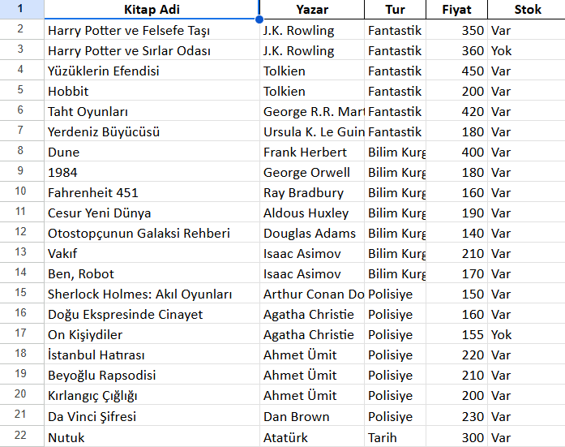
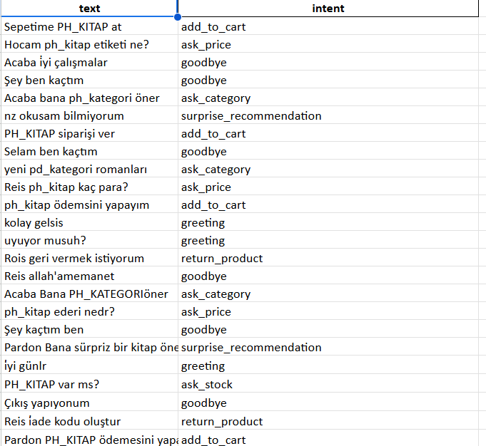
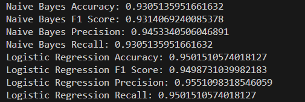
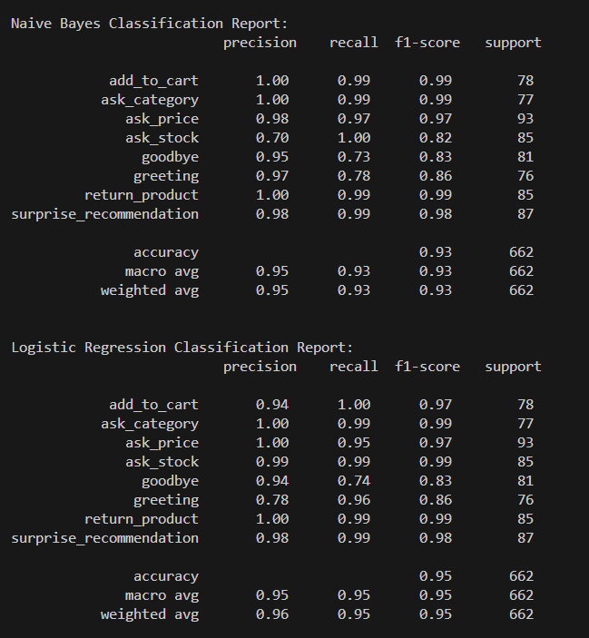
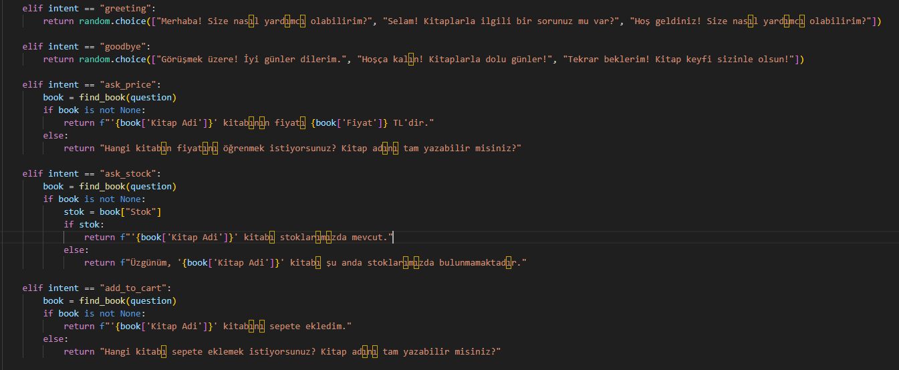
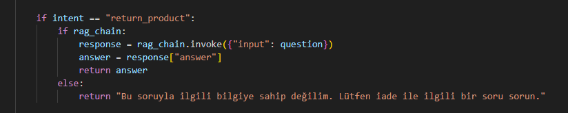
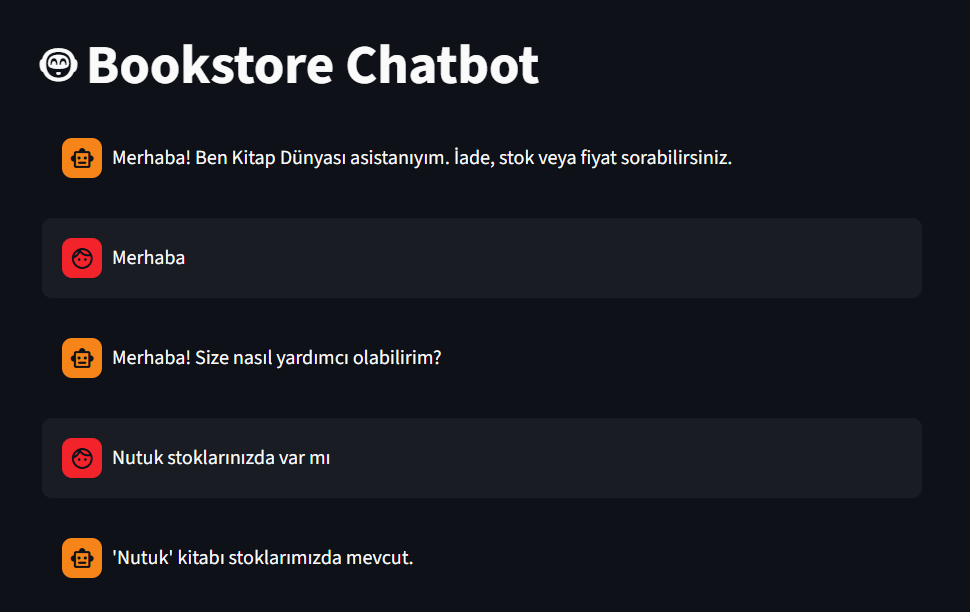
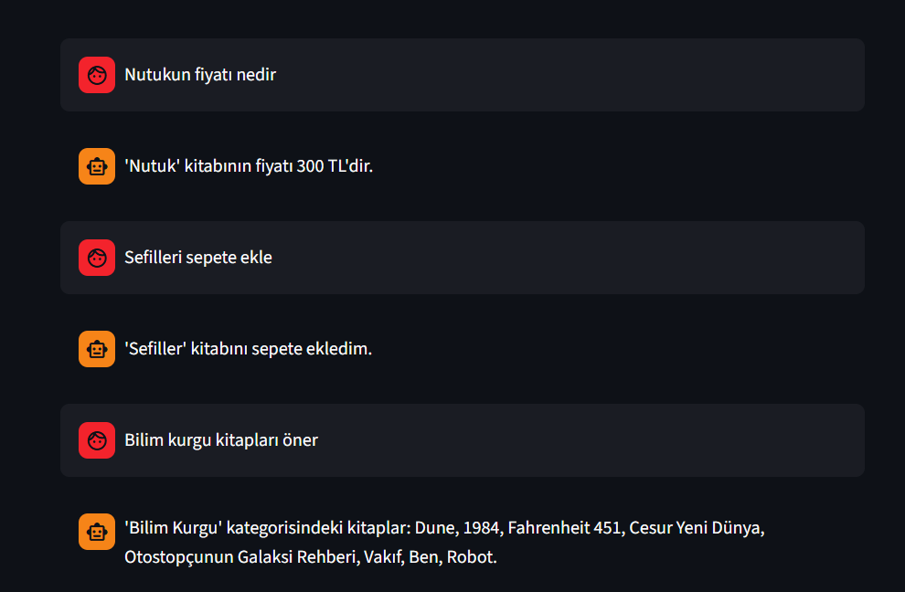
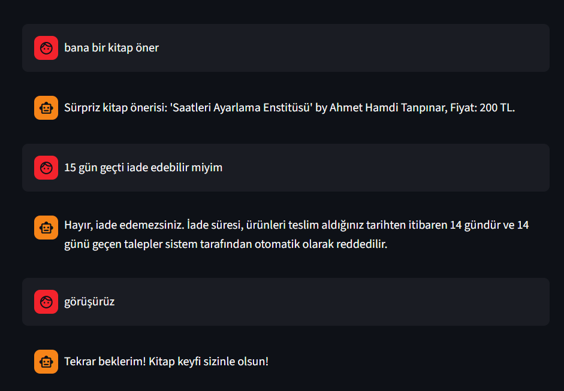
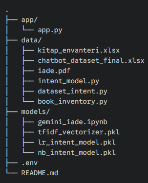

## 📚 Kitap Dünyası(AI-Powered Bookstore Chatbot)

**Kitap Dünyası Asistanı**, bir e-ticaret kitap mağazası için geliştirilmiş; kural tabanlı sistemler, makine öğrenmesi (NLP) ve üretken yapay zekayı (LLM) birleştiren **Hibrit Mimariye** sahip akıllı bir sohbet botudur.

Müşterilerin stok, fiyat ve karmaşık iade prosedürlerini doğal dilde yanıtlamak için tasarlanmıştır.

## Projenin Amacı ve Çözdüğü Sorunlar

Geleneksel chatbotlar ya sadece butonlarla çalışır ya da her soruya yanlış cevap verme (halüsinasyon) riski taşır. Bu proje, bu iki sorunu şu yöntemlerle çözer:

1.  **Esneklik (Flexibility):** Kullanıcının doğal dilini anlamak için **Logistic Regression** ve **TF-IDF** kullanılır.
2.  **Kapsam (RAG):** İade politikası gibi uzun metinleri anlamak için **Retrieval-Augmented Generation (RAG)** kullanılır.

## 🧠 Teknik Mimari (Nasıl Çalışıyor?)

Proje 3 ana katmandan oluşur:

### 1. Niyet Analizi (Intent Classification)
Kullanıcının ne demek istediğini (Fiyat mı soruyor? Selam mı veriyor?) anlamak için eğitilmiş bir Makine Öğrenmesi modeli kullanılır.
* **Teknik:** Slot Masking + TF-IDF + Logistic Regression
* **Özellik:** Modelin özel isimleri (örn: "Nutuk") ezberlemesini (overfitting) engellemek için **Slot Masking** tekniği uygulanmıştır. (Örn: *"Nutuk ne kadar?"* -> *"PH_KITAP ne kadar?"*)

### 2. Veri Sorgulama (Data Retrieval)
* **Excel Entegrasyonu:** Kitap adı, yazar, fiyat ve stok bilgisi anlık olarak `kitap_envanteri.xlsx` dosyasından çekilir.
* **Maskeleme Motoru:** Kullanıcı girdisindeki kitap isimlerini otomatik algılar ve maskeler.

### 3. RAG Sistemi (Retrieval-Augmented Generation)
* Karmaşık iade ve değişim soruları için `iade.pdf` dokümanı vektörel veritabanına (Chroma) dönüştürülmüştür.
* Cevaplar **Google Gemini 2.5 Flash** modeli tarafından, PDF içeriğine sadık kalınarak üretilir.

## 🛠️ Kullanılan Teknolojiler

* **Dil:** Python 3.10
* **Arayüz:** Streamlit
* **NLP & ML:** Scikit-learn (Logistic Regression, TF-IDF), NLTK
* **LLM & RAG:** LangChain, Google Generative AI (Gemini), ChromaDB
* **Veri Yönetimi:** Pandas (Excel İşlemleri)

---

## 📊 Veri Seti ve Hazırlık Süreci

### 1. Kitap Envanteri (Gerçek Veri)

* **Dosya:** `data/kitap_envanteri.xlsx`
* **İçerik:** Kitap Adı, Yazar, Tür, Fiyat, Stok Durumu.

*(Şekil 1: Sistemin kullandığı kitap veritabanından bir kesit)*

### 2. Eğitim Verisi (Sentetik & Maskeli Veri)
Modelin ezber yapmasını (overfitting) engellemek için **"Slot Masking"** tekniği ile 5000+ satırlık sentetik veri üretilmiştir.
* **Yöntem:** Şablon tabanlı üretim + Gürültü Ekleme (Harf hatası, devrik cümle).
* **Maskeleme:** Kitap isimleri `PH_KITAP`, yazar isimleri `PH_YAZAR` olarak genelleştirilmiştir.

*(Şekil 2: Maskelenmiş ve gürültü eklenmiş eğitim verisi örneği)*

---

## 🎯 Niyet Sınıflandırma (Intent Classes)

Bot, kullanıcıdan gelen mesajları aşağıdaki 9 ana kategoriye (Intent) ayırır:

| Intent (Niyet) | Açıklama | Örnek Cümle (Maskelenmiş) |
| :--- | :--- | :--- |
| `ask_price` | Fiyat sorma | *"PH_KITAP kaça patlar?"* |
| `ask_stock` | Stok sorma | *"Elinizde PH_KITAP kaldı mı?"* |
| `ask_category` | Kategori/Tür sorma | *"Bana PH_KATEGORI türünde bir şey öner"* |
| `add_to_cart` | Satın alma | *"Sepete PH_KITAP ekle"* |
| `return_product` | İade/Değişim (RAG) | *"Jelatini açtım iade olur mu?"* |
| `greeting` | Selamlaşma | *"Selamun aleyküm"* |
| `goodbye` | Vedalaşma | *"Ben kaçtım, iyi çalışmalar"* |
| `surprise_recommendation` | Sürpriz Öneri | *"Ne okusam bilemedim, şaşırt beni"* |

---

---

## 📈 Model Performansı ve Metrikler

Sınıflandırma işlemi için **Naive Bayes** ve **Logistic Regression** modelleri karşılaştırılmıştır. Gürültülü ve maskeli veri setinde **Logistic Regression** daha kararlı sonuçlar vermiştir.

### Karşılaştırmalı Sonuçlar

### Performans Metriği (Performance Metric)
Aşağıdaki matris, modelin genel performans metriklerini göstermektedir.

*(Şekil 3: Performans Metrikleri)*

### Sınıflandırma Raporu (Classification Report)

*(Şekil 4: Modelin detaylı başarı metrikleri)*

---

## ⚙️ RAG Sistemi Teknik Spesifikasyonları

İade ve değişim politikaları gibi hassas konularda **%100 doğruluk** sağlamak ve halüsinasyonu (yanlış bilgi üretimini) önlemek amacıyla sistem parametreleri aşağıdaki gibi optimize edilmiştir:

### 1. 🧠 LLM (Büyük Dil Modeli) Yapılandırması
Cevap üretiminde Google'ın en hızlı ve maliyet etkin modellerinden biri tercih edilmiştir.

| Parametre | Değer | Açıklama |
| :--- | :--- | :--- |
| **Model** | `Gemini 2.5 Flash` | Düşük gecikme süresi (low-latency) ve yüksek bağlam kapasitesi için seçildi. |
| **Temperature** | `0.0` | **Deterministik Çıktı:** Modelin yaratıcılığı kapatılarak sadece verilen bağlama sadık kalması sağlandı. |
| **Max Output Tokens** | `2000` | Uzun ve detaylı prosedür açıklamaları için yeterli alan bırakıldı. |
| **Framework** | `LangChain` | Model orkestrasyonu ve zincir (chain) yapısı için kullanıldı. |

### 2. 🗄️ Embedding ve Vektör Veritabanı
Metinlerin sayısal vektörlere dönüştürülmesi ve anlamsal arama (semantic search) altyapısı.

| Parametre | Değer | Açıklama |
| :--- | :--- | :--- |
| **Embedding Modeli** | `Google Generative AI Embeddings` | Yüksek anlamsal ilişki başarısı sağlayan Google embedding altyapısı. |
| **Veritabanı** | `Chroma DB` | Açık kaynaklı, yüksek performanslı yerel vektör deposu. |

### 3. ✂️ Veri İşleme ve Parçalama (Chunking Strategy)
PDF dokümanının LLM'in anlayabileceği parçalara bölünme stratejisi.

| Parametre | Değer | Açıklama |
| :--- | :--- | :--- |
| **Splitter Algoritması** | `RecursiveCharacterTextSplitter` | Metni mantıksal bütünlüğü bozmadan (paragraf, cümle bazlı) böler. |
| **Chunk Size** | `500 Token` | Her bir parçanın boyutu. Bir iade maddesinin tamamını kapsayacak kadar geniş tutuldu. |
| **Chunk Overlap** | `50 Token` | **Bağlam Kaybını Önleme:** Bölünen parçalar arasında örtüşme bırakılarak cümlenin kesilmesi engellendi. |
|

---

### 💡 Neden Bu Ayarlar Seçildi?

* **Neden Temperature 0.0?**
    İade politikaları yorum kaldırmaz. "Belki iade alırlar" gibi muğlak cevaplar yerine, dokümanda ne yazıyorsa kesin olarak onu söylemesi için yaratıcılık sıfırlandı.
* **Neden Gemini 2.5 Flash?**
    Chatbotlarda hız kritiktir. Flash modeli, Pro modeline göre çok daha hızlı yanıt verirken, RAG görevlerinde yeterli zekaya sahiptir.

---

### Çalışma Mantığı?

* **Temel Mantık**
    *   Eğer 'return_production' intenti dışında bir intent algılanırsa kitap_envanteri.xlsx tablosundan isteğe göre bilgi çekilir kullanıcıya gösterilir.

    

    *   Ama 'return_production' intenti algılanırsa sorgu RAG sistemine gider ve oradan dönen bilgi kullanıcıya gösterilir.

    

### Demo Görüntüleri
    
*   **Örnek-1**

    

*   **Örnek-2**

    

*   **Örnek-3**

    

---

### Proje Şeması

*   **Dosya Şeması**

    

---